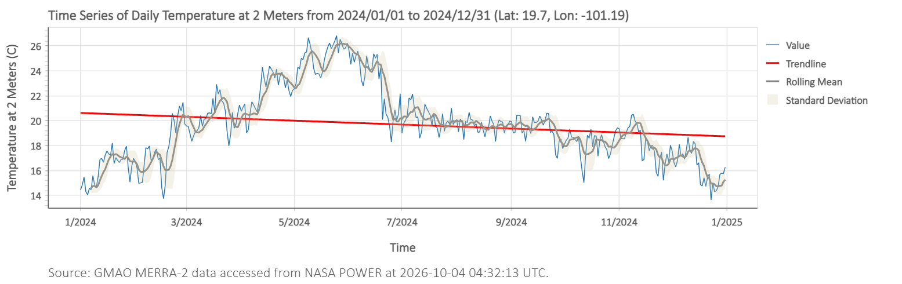

# Temperatura Morelia 2024 - NASA POWER

Analicé 365 días de temperatura de Morelia, Mich. con datos satelitales de la NASA (GMAO MERRA-2).

## Hallazgos
- Ola de calor en Mayo 2024: 27°C
- Enfriamiento en temporada de lluvias (Junio): 20°C
- Fuente: NASA POWER DAV / GMAO MERRA-2

## Herramientas
Python, NASA POWER API, GitHub

**Ubicación:** Lat 19.70, Lon -101.19
**Coordenadas Morelia**

